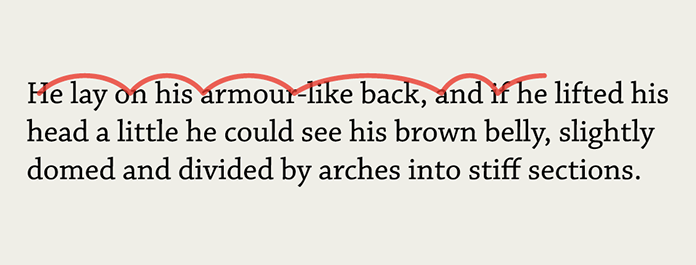
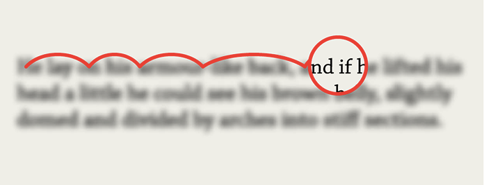
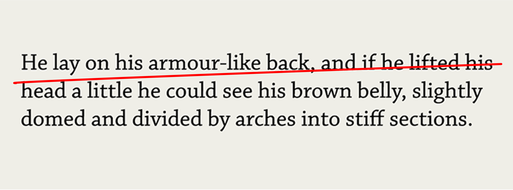

# Look and Feel - Corporate Identity

## Typografie en leesbaarheid

<!-- Over fonts, regellengte en responsive layouts coderen met EM, en andere CSS units  -->

In deze sprint *Look & Feel* leer je meer CSS technieken voor typografie.

In Sprint 2 heb je de basisregels voor goede leesbare teksten op het web geleerd:
De font size is minimaal `16px`, een goede regellengte is 10–12 woorden en niet langer dan `40em` en de regellafstand is `140%`.

```css
body {
    font-family: 'Open Sans', Helvetica, sans-serif;
    font-size: 16px;
    line-height: 1.4;
}
```

### Aanpak

Eerst ga je websites analyseren om te leren hoe websites typografie toepassen. 
Daarna ga je zelf een font maken en in CSS gebruiken. 
Tot slot ga je oefenen met verschillende CSS units. 


## Typografie en CSS properties

“Web Design is 95% typography”

Dit schrijft het designbureau IA.net. Een website bestaat niet alleen uit titels en de teksten, maar ook uitleg bij foto's, buttons, en bijvoorbeeld labels van formulier-elementen bevatten tekst. 

In CSS bestaan veel *properties* om fonts goed vorm te geven, zoals `font-family`, `font-weight`, `font-stretch`, `font-variant`, `font-size`.

```css
body {
    font-family: 'Open Sans', Arial, sans-serif;
    line-height: 1.4;
    font-weight: normal; 
    font-stretch: normal;
    font-variant: small-caps;
    font-size: 16px;
}
```

Deze *properties* kan je ook met de font *shorthand* schrijven, dat ziet er zo uit: 
```css
body {
    font: normal small-caps normal 16px/1.5 'Open Sans', Arial, sans-serif;
}
```

CSS heeft veel meer mogelijkheden om teksten goed leesbaar te maken, zoals `line-height`, `word-break`, `word-spacing`, `letter-spacing` en `hyphens`. 

### Opdracht

Onderzoek bij de [artikelpagina van de Correspondent](https://decorrespondent.nl/15628/alarm-slaan-of-beter-bewijs-zoeken-de-wetenschappelijke-strijd-achter-kantelpunten-in-het-klimaat/babb3b1e-e017-0dcf-24e7-044ff58251d1) en een [artikel van Pixel Ambacht](https://pixelambacht.nl/2021/optical-size-hidden-superpower/) de *properties* en *values* die de websites gebruiken voor goed leesbare teksten.

Schrijf op het whiteboard per website de
- font-family
- font-size
- line-height 
- Breedte van het tekst element op verschillende viewport sizes
- Andere interessante CSS properties voor typografie

### Bronnen

- [Fundamental text and font styling - MDN](https://developer.mozilla.org/en-US/docs/Learn/CSS/Styling_text/Fundamentals)
- [Font properties en shorthand](https://css-tricks.com/almanac/properties/f/font/)

<!--
## Micro- en macro-typografie (advanced)

In typografie is er onderscheid tussen micro- en macro-typografie. Micro-typografie gaat over de details, zoals letters, spatiëring, _kerning_ en woordspatiëring.
Macro-typografie is meer gericht op het font en de layout.

Bijna al deze typografische settings kun je met CSS (en HTML) aanpassen.

> Micro typography deals with detailed aspects of type and spacing, focusing on the readability of text:
> - Tracking and Glyph-width
> - Protrusion, margin kerning, or hanging punctuation
> - Punctually increasing or decreasing word space
> - Chunking words through word spacing or other white space
>
> Macro typography covers many aspects of what we nowadays call Web design:
> - The Format: The basic dimensions within which we set type
> - The Grid: Type size, proportion of columns
> - The Hierarchy: How the different type sizes and the formatting relate to each other
> 
> [Web Design is 95% Typography](https://ia.net/topics/the-web-is-all-about-typography-period) - Ia.net

### Opdracht

Lees het artikel “Web Design is 95% Typography” en onderzoek met welke CSS properties je micro- en macro-typografie kan toepassen. 
Gebruik hiervoor de lijst op CSS Reference *Typography properties* en *Wrapping and breaking text* van MDN.

Hou in je Learning Journal bij wat je hebt onderzocht en uitgeprobeerd. 

### Bronnen

- [Web Design is 95% Typography](https://ia.net/topics/the-web-is-all-about-typography-period)
- [Typography properties - CSS Reference](https://cssreference.io/typography)
- [Wrapping and Breaking text - MDN](https://developer.mozilla.org/en-US/docs/Web/CSS/CSS_text/Wrapping_breaking_text)
-->


## Hoe lezen we?

Lezen is een complex process. Als we lezen, hebben we intuïtief de indruk dat onze ogen over de regels glijden. Maar dat is niet het geval.  Onze ogen maken sprongetjes die over de tekst gaan. 

Er zijn drie soorten oogsprongen, of _saccades_: 
- Sprongen voorwaarts over een aantal letters of woorden
- De regelsprongen, grote sprongen van het eind van de regel naar het begin van de volgende
- Terugsprongetjes, die zomaar in de regel plaatsvinden, alsof het oog even terug wil kijken naar wat het net tevoren ook al gezien heeft, deze terugsprongen doen we in het algemeen onbewust. 

De oogsprongen vragen om duidelijke fixatiepunten, om een goede structuur van de tekst. 
Fixatiepunten zijn de letters, woorden, regels, alinea’s en koppen van een tekst. 
Fixatiepunten vereisen goede letterafstanden, woordspaties, regelbegin, en -lengte, alinea's, en plaatsing en indeling van koppen. 

<!-- Vrij naar Ton Bolder, uit Typografie, uitgangspunten, richtlijnen en techniek, blz 127 & 128 -->

### Oogsprongen over letters of woorden
Terwijl onze ogen over de tekst bewegen, maken onze ogen een reeks heen en weer bewegingen die saccades worden genoemd, of sprongetjes over een regel tekst. Soms is het een groot sprongetje, soms is het een klein sprongetje.

<br>


### Fixaties 
Tussen oogsprongen stoppen onze ogen voor een fractie van een seconde in wat een fixatie wordt genoemd. Tijdens deze korte pauze zien we een paar tekens duidelijk, terwijl de rest van de tekst vervaagt.

<br>


### Regelsprongen
De ogen springen aan het eind van een regel naar het begin van de volgende. Een goede regellengte, regelafstand en duidelijk begin van een regel zorgt voor goede leesbaarheid. 

<br>


### Tips voor leesbare typografie
- Gebruik geen `text-transform: uppercase`; met allemaal hoofdletters hebben je ogen geen fixatiepunten
- Gebruik altijd een `text-align: left`; dan is het begin van de regels makkelijk te 'vinden', met gecentreerde teksten begint elke regel op een andere plek, wat de regelsprongen van de ogen moeilijker maakt
- Gebruik altijd genoeg `line-height`; dat maakt de regelsprong makkelijker. Als je witte tekst op een donkere achtergrond hebt, is het verstandig om meer `line-height` te gebruiken dan `1.4`
- Gebruik geen `text-align: justify`; dat ziet er aan de randen van een tekst misschien mooi uit, maar tusen de woorden zitten verschillende ruimtes wat de oogsprongen moeilijker maakt

### Bronnen 
[How We Read by Jason Santa Maria](https://alistapart.com/article/how-we-read/)


## Font-family en lettertypes

Met de *property* `font-family` kan je de browser 'vertellen' welke fonts je wilt gebruiken, via een _font stack_. Dat ziet er zo uit: 

```css
body {
    font-family: 'Open Sans', Arial, sans-serif;
}
```

Hier probeert de browser eerst een extern font te gebruiken, Open Sans. Als dat font niet lukt, mag de browser een systeem-font gebruiken, Arial. 
Als dat font niet bestaat, dan mag de browser zelf een _generiek_ `sans-serif` font gebruiken om de website te renderen. 
Dit wordt de *font stack* genoemd, en hiermee zorg je ervoor dat de website altijd zo goed mogelijk gerenderd zal worden.

Er bestaan verschillende soorten generieke font-families, zoals `serif`, `sans-serif` en `monospace`. Zorg ervoor dat je bij de font-family altijd een generieke font-family meegeeft, zodat de browser als fallback een passend font gebruikt en niet de *browser default* gebruikt (meestal *Times New Roman*).

### Schreef en schreefloze lettertypes

'Serif' of schreef-letters hebben kleine uitsteeksels aan de stokken en staarten. Die zorgen ervoor dat letters beter van elkaar te onderscheiden zijn, en dus beter leesbaar zijn. Zo wordt de leesbaarheid van een tekst verbeterd. Dit was vooral van belang toen de drukpersen nog niet zo goed waren. 'Sans-serif' of schreefloze-letters hebben geen schreef.
 
*Het verschil tussen schreef (Serif) en schreef-loze (Sans-Serif) lettertypes.*

### Monospace lettertypes

`Monospace` letters zijn allemaal even breed. Voordeel hiervan is dat ze goed uitlijnen. Dit kan je daarom goed gebruiken voor het presenteren van getallen. (Voor getallen kun je ook `font-variant-numeric` gebruiken, als je lettertype dit ondersteunt.)

 
*Monospaced letters zijn allemaal even breed.*

### Fonts laden

Het is mogelijk om voor jouw website een extern font in te laden. 
Hiervoor gebruik je `@font-face`. 
Je roept hiervoor een extern font bestand aan. Nadat het geladen is, kan je het gebruiken voor je styling. 

```css
@font-face {
    font-family: 'Open Sans';
    src: url('opensans.woff2') format('woff2');
}

body {
    font-family: 'Open Sans', Arial, sans-serif;
}
```

Op deze manier kan je lettertypes gebruiken die niet standaard in een browser aanwezig zijn. 

### Opdracht

Voor deze opdracht ga je zelf een font maken en gebruiken in CSS.
Maak je eigen _pixel font_ met de online tool https://config.aresluna.org

Download het font als OTF font in een folder. Gebruik `@font-face` om het font te laden en gebruiken in CSS. Doe dit bijvoorbeeld op (een onderdeel van) je eigen I Love Web website. Let op: dit is niet het `woff2` format, maar het `opentype` format.

#### Bronnen

- [Web Fonts](https://developer.mozilla.org/en-US/docs/Learn/CSS/Styling_text/Web_fonts)
- [Font Family - MDN](https://developer.mozilla.org/en-US/docs/Web/CSS/font-family)
- [@font-face @ MDN](https://developer.mozilla.org/en-US/docs/Web/CSS/@font-face)
- [How to use @font-face in CSS @ CSS Tricks](https://css-tricks.com/snippets/css/using-font-face-in-css/)
<!-- - [A complete collection of web safe CSS font stacks](https://www.cssfontstack.com) -->
- Marcin Wichary, Director of Design van Figma, laat zien hoe vet pixel fonts zijn: [In defense of an old pixel](https://www.youtube.com/watch?app=desktop&v=SDI8ubVZi7w)


## CSS Units

In CSS bestaan er heel veel *units* die je kan gebruiken. 

Er bestaan *absolute length units*, zoals de `px` (pixel). 
*Font-relative length units*, zoals de `em` en `rem`. 
*Viewport relative units* zoals de `vw` en `vh`, die afhankelijk zijn van de breedte of hoogte van de viewport. 
En nog veel meer ...

De EM is een *Font-relative length unit*. 
In oorsprong is het de breedte van de hoofdletter “M” van het lettertype. 
De EM is een 'relative unit', het is afhankelijk van het font, de font-size en de DPI settings. 
Het wordt vaak gebruikt voor de `font-size` en regellengte, omdat je in verhouding tot het font de typografische waardes kan bepalen. 

### Opdracht

Om te leren wat je zoal kan doen met al die verschillende CSS units ga je de lengte van een zin op verschillende manieren bouwen. 

Open je code editor en maak een blanco HTML pagina `font.html`,  en sla deze op in jouw i-love-web repo. 
Maak een leeg CSS file `font.css` en voeg het toe aan het HTML file. 

Gebruik onderstaande HTML *snippet* voor de experimenten. 
Kopieer voor elk experiment deze HTML zodat je ze kan vergelijken:

```html
<section>
  <blockquote cite="http://webtypography.net/2.1.2">
    <p>Anything from 45 to 75 characters is widely regarded as a satisfactory line length for a single-column page set in a serifed text face in a text size. The 66-character line (counting both letters and spaces) is widely regarded as ideal. For multiple column work, a better average is 40 to 50 characters.</p>
  </blockquote>
  <p>—Robert Bringhurst</p>
</section>
```

<!--De beroemde grafisch ontwerper Robert Bringhurst komt tot het uitgangspunt: een goede regellengte heeft 45–75 karakters, oftwel 10–12 woorden. -->
Gebruik verschillende CSS units om ervoor te zorgen dat de regellengte van een zin op 10–12 woorden komt:

- Behalve pixels zijn de *Absolute length units* niet geschikt voor het web, lukt het je toch om met `cm` of `mm` een regel van zo'n 10–12 woorden te maken? Hoeveel `px` is dat? 
- Gebruik daarna de *Font-relative length units*. Hoeveel `em` heb je nodig voor een goede regellengte? En in `ch` dan? Wat is het verschil als je `rem` gebruikt? Wat gebeurt er als je dezelfde tekst met een ander font gebruikt?
- Experimenteer tot slot met *Viewport relative units* en *Container units*, zoals `vw` en `cqw`. En wat doen `dvw` of `vmax`?

#### Bronnen

- [CSS values and units - MDN](https://developer.mozilla.org/en-US/docs/Learn/CSS/Building_blocks/Values_and_units)
- [The amazing em unit and other best practices](https://www.w3.org/Style/LieBos3e/em)
- [Em (typography) - Wikipedia](https://en.wikipedia.org/wiki/Em_(typography))


<!--
Tot slot ga je leren hoe je op basis van de regellengte een responsive layout kan ontwerpen en bouwen. 


## Responsive layout
Responsive desing op bais van regellengt met EM
Wat is beter, pizels of em?
Uitdaging: Grid layout responsive zonder medie queries

Er zijn verschillende manieren(strategieen) om sizes te definieren in CSS. Ook nieuwe manieren > laten zien

Vandaag typografische verhoudingen bepalen aan de hand van EM.
Je kan dan ook de responsive layout hierop baseren, met de regellengte als uitganspunt. Hoe breed is minimaal? Hoe reken je dat uit? En dan een media query, met min width voor een vloeiende opvulling.

Er zijn ook andere manieren om responsive layouts te maken. Op een component. In grid zonder media queries. En in pixels. Kan allemaal ...
-->
